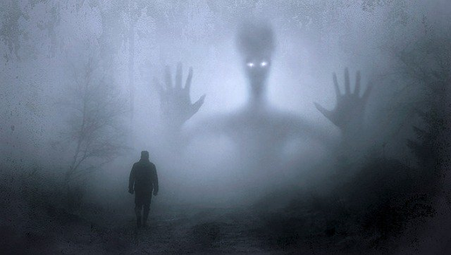

# Fear
  

What you are able to do against, when you are scared.  
Let me try to explain how I see this.
We have three different times in our life.   

## Past
One is the past. Something that you have experienced an amount of time ago. Because of the fact that we, as a human being, are able to remember bad things more easily than good things, can lead to depression if we think about the past.  
One thing we can do is to write down all the good things happening to us that every day and read it from time to time to develop a good mood thinking about the past.

## Future
Thinking about the future can lead to fear. Thoughts like, "the plane might crash", will keep you home instead of flying to a nice holiday location.  
"This or that might happen, if..."  
You are creating this scary thoughts on your own.  
If you know, that the future does not exist at all, then you will not get scared any more. Yes, future does not exit. Future is just an idea, an illusion. There is only the *here an now*.

## Here and now
Even if you are doing something tomorrow, than you are not doing it in the future. You are doing it **now**.  
There is only **now**. Are you really sure, that you have experienced the things you have in memory? "Of course", you might say. But are you really sure? Have you got evidence?  

An example.
I am writing a book right now. I am really sure that I am writing a book right now. What if tomorrow my computer crashes and my book will be erased? I will have no evidence that I wrote a book the last day.  
True?  

Of course I am going to save my book in the cloud as soon I have wi-fi again. I am not an idiot.  

So for me, past and future does not exist at all. These are just constructs of the human mind. Also time does not exists at all. Time is an invention of people who wanted to control other human beings. They need time to track your working hours.  
  
Yes, I am also a budhist and a tantric teacher and my knowlegde I have from wise people. I don't know if this is the very truth at all, but I made the decision to belief in it. And what I belief in, will manifest into my reality.  

If you are able to stay in the here and now, you are not getting scared any more. If you are getting scared, then you should just switch back to the here and now.  
Take a deep breath right now. Do you still feel fear?  
Is this what you are scared about happening right now?  
No, you are calm I hope and reading this book!  

## Other methods

###EFT
With EFT (Emotional Freedom Technology) you can knock away anxiety. EFT is a method to change your subconsciousness. You are repeating mantras over and over while knocking some spots on your body. You are doing it so long and so often until these mantras sink into your subconsciousness. A sample might be. "Even if I fear to fly with a plane, I accept myself as I am." You repeat this over and over until you get rid of the fear to fly with a plane.  

### Psych-K
Psych-K is a very good and fast method to re-program your subconsciousness. With this method you combine both parts of the brain, go into a meditative state of mind and think about, where this belief comes from. Often beliefs come from the parents, brothers, sisters, friends, school etc. Not all beliefs are based on a solid experience of ourselves. Even if we have made an experience, our subconsciousness still beliefs and reacts based on beliefs. When I say that it reacts, I mean most of the time we are running on auto pilot. Do you remember the first time you were driving with a bike? I had to think about almost every single muscle to move in the right order at the right time. Today I don't even think about my muscles any more. I just drive somewhere. My subconsciousness is doing that on it's own. The same is true for breathing, heartbeat, growing fingernails, healing wounds, growing the hair and splitting and regenerating cells. Everything on auto pilot. So if we reprogram ourself, we can change our life completely. This is also true for fears.  

### Doing until it's fun
Doing what you are scared about until you love todo it is also a good method I used once. I was driving a motorbike in Switzerland a few years ago. Every time I had to go through a tunnel I got scared to stuck in a traffic jam and will not be able to breath fresh air. I was remembering a post about dioxin in the Elbtunnel in Hamburg. Once there was a long tunnel like 8 km long. I was scared a bit. On my way back I had three options. One option was to use a pass. It was getting dark, so driving a pass scared me more. Going back the way I came also was no option, so I choosed to drive a different way even if there could have been even more tunnels. But I took the wrong entry to the highway and this leads me back into the same tunnel. Now I have tricked my brain thinking, "I made it here without dying, so I can also make it back" This has worked for me. A few months later, it was very hot and I had an open helmet. The air was to hot for me even driving my bike. It was about 36 degrees. Then I also was driving in a tunnel, but this time it felt really refreshing because the temperature was only 25 degrees. This way I could get rid of my fear about tunnels.

