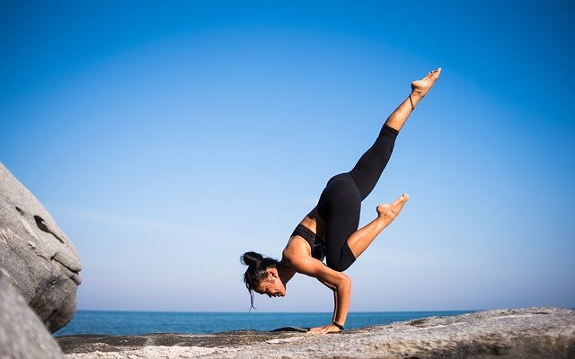
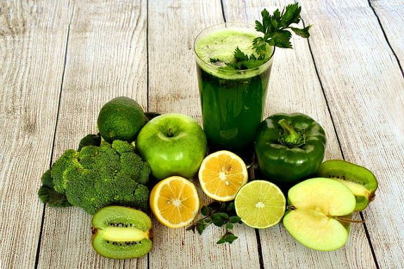

# Health
  

If you want to live an independent life you should also stay healthy so that you do not need doctors or medicine.  

I tell you something. You don't need a disease anymore.  
Do your remember the first time when you are getting ill?  Often the first time is when you are going to kindergarten or school. That's because you are a bid more stressed than staying home. Being stressed shuts down our imunesystem and it's easier for diseases to break out. In fact when you are stressed, then your power to manifest things is getting lower.   
So... no stress, no disease.  
If you stop to believe in diseases you will not be feared of them anymore and therefore you do not attract them anymore.  

I remember that I was working as a mechanic one time. I had done three weeks the same things over and over again. It does not fulfill me at all. So I drank beer in the evening and woke up late in the morning and also came late to the job. The next day I also woke up late and don't wanted to go to work, because I was ashamed that I was late two times in a row. So I went to the doctor to get myself an excuse for my boss. To be able to tell the doctor the truth I was thinking about symthomes of a disease. This way I have manifested these symthoms.  
You get the point?  

I manifested my disease on my own. So is everybody doing. But if we don't want to work anymore and only doing what we love, than we don't have to go to the doctor anymore to get these excuses. We don't have to be sick anymore.  

So stop watching televison or watching radio, where they tell you about all the bad things that has happen in the world. They are doing this only to make us stressed, so that we do not come into our might. Into our higher being.  

If we are not stressed we are able to meditate. Meditating brings us next to our higher self. You should also meditate when you are stressed to calm down.  
Doing Yoga on a daily base keeps your spine flexible and you are able to stay young.  

## Nutrition
  

For me vegetables and fruits are the best for my body.  
We should stop eating meat, because when a animal dies, then stress hormons were produced in the animal and this is then inside the meat.  
Also, we are eating meat, because of the prana inside of the meat. The animals get the prana out of the fruits and the fruits get the prana from the sun. Why not use the prana from the sun directly?  
It's a ongoing process. We can not switch to be a breatharian adhoc, but we are able to stop eating meat and therefore killing animals.  
It's more healthy to eat veggies instead.  

I know from a good friend, that she survived her cancer eating only raw food. Raw veggies of course. Today she is only drinking the juice from the food and she looks pretty awesome in her 50th.  
When you have eaten meat and other processed food, then you should detox your body.  
Fasting helped me a lot. Yes the first three days are kind of hard. Every restaurant, every shop and so on was trying to attract me. But after three days the immune system resets and I was not hungry anymore. I am not talking about this fasting where the people eats only in the night. This is not fasting for me at all. This does not seem health at all.  
I mean water fasting or at least juice fasting. Only drinking water for a couple of days.  

## Breathing
To get prana it is also important to breath more deeper into your belly. So smoking is not a good option. Instead we should breath more on a conscious way to get more prana.  
If you feel unhealthy you should fast and only drink water. Not eating for three full days resets your immune system and every additional day cleans your body. While fasting you should avoid stress. Meditating and breathwork in the sun while fasting is the key to get prana.  
I am fasting on a regular base. Every two month I am fasting for at least 5 days.
The longest time I did fasting was at a rainbow gathering for 12 days, but to be honest, after the fiths day I had a cup of rice to clean my colon.  
