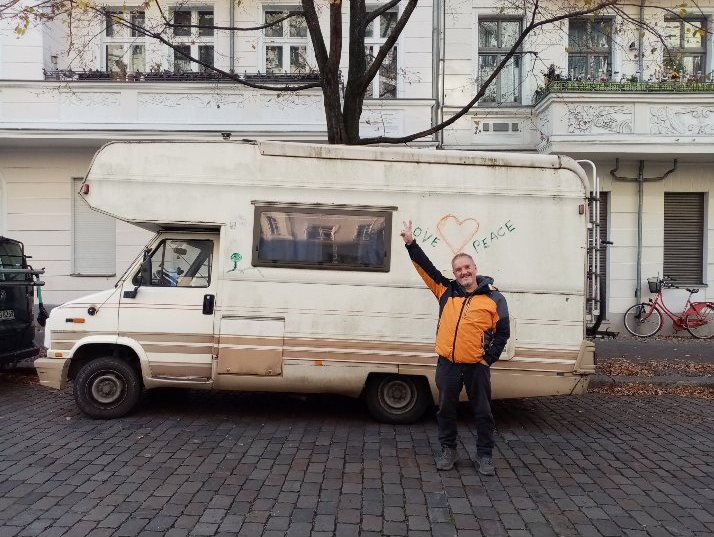

# How I did it

2014 I was working for the banksters in Zürich, getting a 5 digit amount each single month, I already told you, and I was not that happy as today.  
I was teaching myself to develop software and made it my hobby. Later I was able to make a bunch of money with it until I realized that I was only doing it for the money and not for fun any more.  

My body was telling me to stop it. I had to go trough two burnouts with a near death experience to be able to really say "STOP!"  

I had the luck, so to say, that I was getting homeless. I was living a few days in the north of Germany in my Toyota Scarlet next to the train station where I had a toilet.  

Luckily I was not poor and was able to buy myself a mobile home. In this mobile home I am living now in Portugal and I have much fun.  

This is the very first month I am living without income. To be honest this is my 4th book and I get a little money from selling at least one of these books. It's just 30-50,- € a month, but it helps to survive.  

The rest of the money I am getting from playing guitar and djembe in the streets.  
Living in a van I do not pay anything else. No house, no electricity, no other bills. 
Just food, which I sometimes find in the trash, and gas for the van to travel.  
Of course I should pay taxes and insurance for the van, but...  

Years ago, I was doing motocross, I already had the idea to buy myself a camper and travel from one track to another, but I was to scared to give up my well paid job. What I want to say is that I was imagining to live in a van. Imagination is a key to manifest things. If you can imagine something, you can manifest it.  
So did I...unconsciously. And the van came 8 years later to me.  
The van was a very good deal. 29 years old, first hand. I bought it from a couple, her parents were driving it and before her grannies.  
I only paid 4.000,- €. As I already said, I was homeless but not poor.  

Of course it is a risk to buy such an old van, but I was a mechanic long ago. I don't want to repair the car totally on my own, but I am able to and I am able to show competence to a garage, so that they will not try to betray me.  

I am now living in my van since 4.5 years and I stopped working 6 years ago. It's easy to live with just the money from the jobcenter in Germany. They had paid 420,- € a month, when I was not sanctioned by them. Additionally they also paid for taxes, insurance and I had to show the van to TüV, where they check the van and the jobcenter had paid me 2.500,- € to repair my van, so that I am able to use it for living the next two years.  
I know this is a very exception in Germany, but I was able to manifest it. You are also able to manifest something like that, you just have to belief in it. **You are creating your reality!**  

Now that I am in Portugal for the winter they stopped to pay me, but it's ok. I will survive, because I am a musician and I am creative.   

I started to play music on the streets in Berlin. There was this nice guy from Ghana I was playing with. He did the beat on an old snare drum and I was able to play along on my djembe. 

 
Last year, in December, I went to the tourist information to check my emails, they have free wifi there and I asked: "Is it allowed to make music here in the streets?" "Yes, but you have to register.", the nice lady replied. "Where can I register?",I asked? "Here"  

I was playing guitar for the very first time here. A friend was busking in the street and I was sitting next to him. While he was making a break, I took his guitar and started to play. No shame, no fear and the people smiled and gave some coins.   
Estou agradecido.  
Thank you Portugal, I love you <3  

So now I am an authorized musician. That feels really good. I was busking alone for the very first time at the 24th of December. Playing just 1.5 hours I got 24 €. Wow, in Portugal I am able to live 6 days with that money. I only need about 4,- € a day. I do not smoke tobacco. I do not pay for weed. I rarely drink beer and wine and I cook for myself.  
The only bad habit is drinking coffee, but I am sometimes going to ask for some beans in a cafe, if I am low on money.  
Now after editing what I wrote I should be honest, I also like to drink red wine and I bought a 5 liter pack at Lidl for about 5,- €. In Germany we call it **Pennerglück** ;-)
The luck of the homeless.
Rich people have to pay hundreds of euros for a good wine and I only have to pay 1,- €.  

Because of the fact, that I am able to make money every day, doing what I love to do, gives me all the freedom I need to be creative.  

With this freedom I am able to create useful content to make this planet a little better.  

**SO CAN YOU**