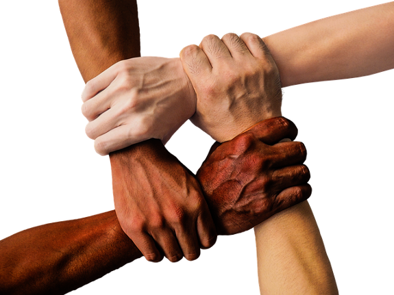
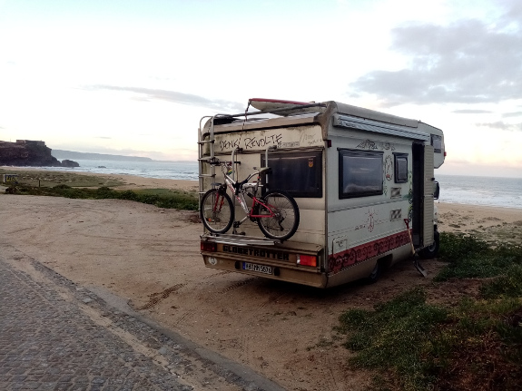
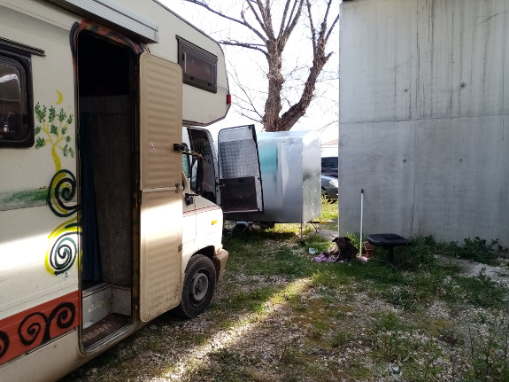
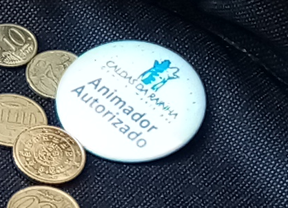
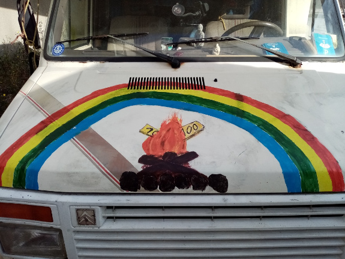
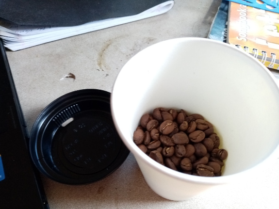

# Some Options to Live a Good Life  
   

I am not able to tell you how to live a good life. This depends on your wishes and circumstances, but I might show you some options how you can create a nice living out of the system.  

There is one thing you should keep in mind. Your life should fulfil you. Only you. Don't do anything you don't want at all. Don't make compromises to make someone else happy. Not even your sexual partner or your best friend.  
If you partner or friend does not like how your are living, then maybe it's not the right partner or friend for you. And you don't have to live together at all. Just meet each other from time to time is also nice.  

## Living

### Community 
Living together in a community has many challenges. I think there are as many stories as there are communities and people living there.  
If you want to live in a community you might have to make compromises. I know that I wrote about not to make them, but...
...if you are able to find consensus with all people in the community, then it's not really a compromise...it's consensus then. You do agree to do it.  
Consensus means, that everybody in the community does agree with the consensus.  

Example: If there are smokers in your community and you have got a common teepee. It could be that some of you don't like the smoke or the smell. This one might bring the point into a talking circle. Then it's up to the community to find a way to live with this.
You might then collect some possible scenarios like.  
 
- Do not smoke in the teepee.
- Do not stay in the teepee if you don't like smoke.  
- Do not smoke while having a talking circle.  

Keep one rule in mind:  
"If it's not good for everybody, then it's not good at all."  
~Michael Tellinger (UBUNTU Movement)

A consensus means everybody will be ok with this kind of rule. In the above case it could be that all agree not to smoke in the teepee. It could also be that this one guy just avoids the teepee. Depends. Maybe the last option could be a good option for everybody. But keep in mind that everybody in the circle should agree. You may look also for other options if there is no consensus yet.

There is also a possibility to have a systemic consensus, if you do not find a solution, because there are maybe to many options, because their are many people in the circle.
To calculate what is the consensus you can use the following technique.
Everybody in the circle can vote all options with a kind of rating. The rating goes from 0-2 (0-10 is a valuable rating for circles with more people).  

- 2 means that this option is a NO-GO  
- 1 means...I don't like it, but it's ok anyway  
- 0 means, I agree with this option  

So the more you dislike an option, the more rating points you give. If there is one in the community, who does not want to attend to the circle to find consensus, then for him or her it's 0 points for all options. Now everybody votes for each option. Then the option with the least points will make it. But do not make the mistake to try to find consensus while one person is away. This person might bring the topic to the next circle again, but yes...this is how it works.  
Example: There are 5 people in the circle and they are voting as follows.  

| Options | Smoker A | Smoker B | Smoker C | Smoker D | Non-Smoker | Rating |
| :--- | :---: | :---: | :---: | :---: | :---: | :---: |
| Not smoke   | 2 | 0 | 1 | 1 | 0 | 4 |
| Not smoke in talking circle  | 1 | 0 | 0 | 0 | 0 | 1 |
| Smoke in teepee  | 0 | 0 | 0 | 0 | 2 | 2 |  

In the above case the consensus is to smoke in the teepee but not while there is a talking circle, because this options has the least points, because only one of the smokers might think, "I wanne smoke every time, but ok, not while talking circle". The smoker can leave to teepee to have his cigarette.  

To have a more detailed version just search the web for *systemic consensus*.

### Van Life
  

This is what I am doing right now. I am living in my van now since 4.5 years. Often I am just camping in the middle of a town. You are able to drive everywhere. You may camp on every camping slot and of course, this is what I do, camp wild. The last option is illegal in most countries, but nowadays the police know about the situations of these people who do not work and have no money. They normally just tell them to leave. In my case I was asked once in three years to leave in Berlin. The police officer was there with a woman and maybe he just wanted to show her, how a good officer he is. Because I wanted to go to Denmark anyway I said, "ok", to avoid an argument.  
Here in Portugal I had once police contact, because we were parking next to a museum, because they had free wifi, and somebody was calling the police and told them that our dogs are running around and shitting in the land of the museum and that we were taking the water from the museum.  
Long story short...I accepted to leave and parked my van 20 meters away ;-)  
The police has done their job and we were fine.  
They told me that they will give me a ticket, but I just said, "Ok, but I will not pay. I don't have money at all.", and they resignated.  
And if they still want to do it, I don't have an address at all, so they cannot send it to me.  
I am travelling with a passport. I do not show my id card. Sometimes I just show my swiss driver license. They might search me there in Switzerland ;-)

I do not use my toilet in van anymore because then I have to empty it every week. I use trees to pee and public toilets to get rid of other things. Sometimes I am using an empty bottle to pee and a bucket with a plastic back to make caca.  

To wash myself I am using the opportunities to shower at friends houses, I just jump into a lake, river or the ocean. In Nazaré I was also in the ocean in a kind of tricky way. I waited for the waves to reach me on the beach to have a kind of horizontal shower. I would not go in the ocean there with these 20 meter high waves. They might pull me in the ocean.  
I also find out that I only need 3-5 cups of water to wash the important parts of my body.  
Also I am most often do not use toilet paper. I use water or leaves instead and then I clean my hands with vinegar or ashes from a camp fire.

I have got a bicycle to go everywhere. That makes it easier to find a spot outside of the city. You are able to find spots next to schools or other public places. They are abandonend at the night and you just also stay there during the day.  
I burned all bridges before, so I do not have to pay for a house or a flat. My van is registered in Germany at my moms house. You can also ask friends to register at there address.  

I have got two solar panels with 200 watts and with them I can fill my mobile phone and with a converter I also have 220 Volts. I am able to fill my computer when it's not running, but I also have a very old Mac book G4 which is not loading, the converter switches of. In this case I often go to libraries to get electricity and also free wifi. Here in one town I also get electricity at the market place where they have got sockets below the banks. In Lissabon, the library was closed because of this pandemy, I was in a cafe behind the lib and they gave me a long cable for my computer, some water for my dog and I only had a coffee for 70 cents. It was a non profit cafe, fighting for human rights. We are helping each other <3

### Living on a sailing yacht
One morning, I was camping in Bern (Switzerland) next to an old gas tank, which is now a place for GOA-Parties and other things, a woman knocked at my van. She ask me if I could help starting their car.  

These nice couple where in Bern to make some money during the winter. Yes Switzerland is a nice place to make a bunch of money, because they pay the highest salaries in Europe and you only have to pay about 10 percent so called *Quellsteuer* which is a kind of income tax.  

They where living on a sailing yacht during the year. They bought the yacht right after she has finished her school in Germany. We were talking about the yacht, because I was interested to buy it.  
They told me that they were sailing around Mallorca and they live from food saving. The hotel there were throwing away much useful food. Sailing would be also nice for me. This way I do not waste much gas, only if I have to drive into a harbour, where sailing is not possible.

### Living in a Tent
I have not done this yet, because I like to carry my kitesurf equip and my music instruments in my van. But if you have got a small car this will work.  
We met Bert and Hans, two German men in Nazaré. They were sleeping together with a dog in their Fiat Panda. They were also cooking inside this car. And they also had music instruments and surf equip.  
But if you don't want to sleep in a car, then the best would be to bring a tent.  

A few days ago I met Rolf from Sweden in Lisbon. He was with his bike and he told me, that he has got a tent outside of Lisbon.

### Couch Surfing
Have done this with my motorbike once. Travelled from Denmark to Switzerland. Visited a massage colleague there and then I was in the south of England where I was getting an invite from another massage colleague.  
There are many places on earth were you may find nice people who do not want to live alone, where you might stay a few days or weeks.

### Biking, Hiking
One day we met Gerd a man from Germany. He was with his bike and a trailer. He told us, that his tent is broken, I gave him my old military tent which I only used once at a rainbow gathering. It was not water proofed, but Gerd said that he will use this old tent as a tarp to protect my tent. He has already driven 5.000 km on his bike and he looked very happy and healthy of course.  

### Squatting houses or land 
I have not done that yet, but a few friends told me about that.  
You find squats to live in, in almost every larger town. Just ask some hippies or punks. Avoid asking junkies, because they might show you a squat with many challenges. Maybe they can live there, me not. But there are nice places like the Gängeviertel in Hamburg, where these people squatted five houses where they are now creating art. The town bought these houses back from the investor and gave it to the people. There you can find a No-Money-Shop, a cafe without prices, you just donate something, a discotheque and many more.  

In Barcelona there is a nive squat where some artists are living. You can see a lot of paintings on the walls inside.  
A friend of mine was there for a few days.  
  
  

A friend told me about a squat in Lisbon, but he told me to avoid it, because it's really dirty there. As I said, it depends on the people living there.  

### Grow your own food
One possibility to step out completely is do buy land, build a shelter and grow food like permaculture.   
About this topic I wrote an own book called "Camp Eden, how we re-created our paradise"

## Making money
If you do not want to support your system paying taxes, then you should stop working in the system. There are many ways to do that.
For me the easiest way to make money on the streets is busking. I am playing guitar in the streets.

Another way of doing this is to be self-employed and not live longer than 6 months in one country. You only have to pay taxes in a country where you are staying more than 6 months. So if you are living 4 months in Portugal for the winter and 4 months in Denmark for the summer and in between you are somewhere else like France or Germany, then your fine.  

### Street music  
  

I have started to live from making music in Portugal last December. I get a badge which shows that now I am authorized to make music. Sometimes I just get about 4,- € and sometimes it's for more than 20,- € for just two hours. I also tried it a few times in Lisbon, but these people are to much in their head right now. There you do not get that much. You should do it more in small towns with normal people.  
The best instrument is that one where you can play freely. Also singing is an option. I have trained my voice in the streets.   

### Helping musicians
Even if you are not a musician at all you are able to help other musicians using a magic hat and ask people around for some coins for the musicians.  
Also dancing in front of the musicians can help them to make some coins. This attracts other people to watch you and you might motivate them to dance also.  
Once a friend had the idea to collect some food. He went on the fruit market, which was next to were we have been playing and he asked the people to spent some spare food for the musicians. That days we were able to share food with 3 other women.

### Juggling  
You can juggle at the traffic lights where the people have to stop and wait. Therefore you have to ask people directly to give you some coins, which needs an "I give a shit mood". I am not their yet. But I will do it, when I get hungry one day. For sure. Btw, I have learned to juggle here in Portugal. I am 56 years now and I was able to do it. Got a video on youtube about that.

### Painting pictures
If you like painting, this is for you. You can create the paintings at home or you can do it life at the spot where you are selling them. It makes sense to combine it.  
Selling paintings is a time consuming job, but you are able to get to know some nice people doing it. You also may show your paintings somewhere else like a pub, a shop or somewhere else.  

### Washing cars  
In n I have seen some people from Bulgaria who helped people to find a parking lot. Some people are happy and give coins. You can also offer to clean their cars while they are going shopping or doing what ever they are doing.  
One of these guys ask me to remove a graffiti on my van. He had a strong liquid like turpentine or so. He erased all the graffiti on the front of my car. He was not asking for money, but I gave him the rest of the whiskey from the night before.  
So now I was able to create a new painting.  
  
  
### Dog or cat sitting
There a many people having animals which have to stay alone at home. Print some flyers where you offer your help and spread them at a supermarket. The people will be very happy to have someone looking after their dogs and cats.  
I did this with cats. Very nice, I can cuddle the whole day, have free electricity, a shower, wifi and get some coins in return.  Ok, I did not get coins this way because I helped a friend, but she invites my for dinner sometimes.  
  
### Baby sitting
The same as for cats is true for babies. They need someone to look after. You should be able to change pampers otherwise this job will be a pain in the ass, I mean in the nose ;-)  

### Creating useful things  
I have not done that yet, but in Lisbon I met a nice guy who create small pieces of art and sell them on the market. It's not really a market, but next to the coast there is a place where some people creates a kind of market on their own.  
The police does not do something against them, because otherwise these people might get criminal instead.  

### Writing Books
This is also something I am doing on a regular base. Once I wrote a bestseller,  
**Python GUI - Develop Cross Plattform GUI Applications using Python, Qt and PyQt5**  
from Olaf Japp  
,which brings me 30-40,- € each month.  
For writing a book I have created my own software the EbookCreator. The EbookCreator is open source and you are able to use it for free. It's running on Windows, Mac and of course Linux.  
Yes there are many other tools on the market to archive this. But I had a special need in colorring the syntax of the source code I was writing about. And I wanted to use Markdown to write books. Maybe you know Markdown from github already.    

You can self-publish your books on [https://kdp.amazon.com](https://kdp.amazon.com) (Kindle direct publishing).   
With EbookCreator you can create epub3 books, which Amazon should accept. There is also a good way to publish ebooks in German language with Tolino Media. They want PDF instead. At the moment I am working on a solution to create PDF with my EbookCreator.  
I am using a 15 year old Mac with InDesign installed to create PDF versions of my books at the moment.  

As you can see, I am giving my books away for free as PDF. This may help poor people to get the content and it helps me to spread my books around the globe. I am also very into the open source philosophie.  
They are also available as ebook. These are easier to read on a kindle and on a smartphone and it gets me a small income.  

Once a friend ask me for my bank account. She was so grateful to read my book that she sends me 100,- €.  
Another friend in Switzerland shared my book with a few people.  
Two of them wanted to get to know me. The one invited me to stay at his bio farm, where I could learn about how to grow apples. And both of them supported me financial, after my mobile phone has been stolen in Madrid.  

**How to write a bestseller you may ask?**  

There is an option in KDP where you can set the price of your book to 0,- € for a day or two and that very day you invite a bunch of people to download your book for free.  
This boost your download ranking and in my case the book was on place one in the chapter cross plattform development for a few days.  Even if I have got only a one star rating, the people buy it. Yeah, I could trick this situation, giving some friends money to buy this book and leave a 5 star rating, but I don't like to trick other people. That does not feel good. I know that someday this book will help someone and I get a 5 star rating to become a 3 star rating in average.  

To be honest, this book helped me once. Because I wanted to write an app for Android using Python and I did not remember how to get there ;-)  

You can also connect to some other authors and help each other writing recessions to make your book more famous to reach more people.  
You are worth to collect money for your book, because you took your time to write it, while other people were going to work an make money.  
Keep that in mind.
 
### CrowdFunding
If you need money for a project, then crowdfunding is a good method to not only collect money, but also to attract new customers.  
It is also good to see, if there is resonance for your project at all. If there is nobody interested into your idea, then you should focus on something else.  

I have started already at least four campaigns. One of them was successful. Someone has stolen my mobile phone in Madrid and I wanted to blog about my journey and therefore I needed a camera, a computer to use Facebook, WhatsApp and Telegram.  
In short, I needed a mobile phone.  
I created a campaign on Facebook, asking for 80,- €, shared this to all of my contacts and I have collected 120,- €.  

Thanks to all my supporters.

## Saving money
### Food Saving  
Do you know that we are throwing away a third part of the whole food on this planet?  
If you are able to get your hands on this food you might also share it with other people, which is a very nice act of socializing. Sharing is caring.  
We were busking next to the fruit market and while counting our coins a friend said, "I will ask them if they have got spare food for the musicians." He came back with a big box of broccoli, apples, potatoes etc.  
I think, I have told this before, but...
You can also have a look at the trash cans of the super market.  
You might ask in the bakery a few minutes before they close if they have got spare bread, they cannot sell the next day.  
In Berlin I found a few refrigerators on the street where people put food to share inside.  
There are many options to fill an empty stomach.  

### Fasting
While waiting here for the sun to disappear behind the horizon I had a look into my kindle for a nice book to read.
It was about prana food from Jasmuheen.  
Yes I am fasting on a regular base. Almost every two months for at least 5 days. I am doing this to save money and it's also really healthy. Your immune system resets after 3 days not eating. Breatharianism is something more higher. I not there yet, but two friends have tried it out. One of them two times. They just tried it. One week no food, not drinking at all. Both of them did not eat about 2 months. So, it is possible!
I have fasted with water for 12 days at a rainbow gathering. There I had very good energy. No distraction from a town. No ads, where they advertise for food. This is very hard, but...
...its possible.  
We do NOT have to eat at all.  
I have learned to fast or the other way round, to use prana from the earth and the sun, instead of using the prana from veggies or even animals.  
Deep in my heart I now that we do not have to eat at all.

That said, fasting is a way to save money and to become a breatharian will be the ultimate goal.  

### Cold coffee
If you do not have gas for cooking and you are not able to make a fire, you can drink also cold coffee. Just mix instant coffee with cold water and shake it in a jar or something similar.

### White coffee
When I drink coffee I am smashing the coffee beans on my own. One day I forget to put the coffee into my cup and I get to know that I forgot to put it in after almost drinking the whole cup ;-)
This day I have invented **White Coffee**. To be honest, the name comes from a good friend.  
Now that another friend sent me the message, that we should drink hot water on a regular base to brink down the corona virus into the stomach to kill it, I am drinking White Coffee on a regular base, instead of expensive coffee.  

### Saving Coffee
  

To get some coffee beans I ask at a cafe or a gas station, if they have got a hand full off coffee beans for me. And I get it almost every time. For free of course.

### Saving Diesel
This idea I have seen from a good friend. He was going to the gas station and ask a driver who was filling his car, if he might donate some liters of diesel.
Just imagine you ask a truck driver who puts hundreds of liters in his truck. When he gives you 5 liters it will not be noticed by his boss. The truck driver does not have to pay for it at all.  
With 5 liter you can go the next 50 kilometers.  

### Fixing things
First of all, think about the fact that you may not need so much things at all.  
Do you really need a tv set? If you like to pay money to get brain washed it may be an option ;-)
Before buying a new car, wouldn't it be better to buy yourself an oldtimer which can be repaired by a normal mechanic instead of expensive mechatronics?  
Maybe you have got a friend who is able to repair cars. It's much cheaper than to buy a new one which is made to break right after the guarantee phase.  
Also electronic devices can be repaired.  
When I grow up we are also giving our shoes to someone who repaired them for us.  

### Room Saving
This is just a theory now, but we should try to manifest it.  
If you see an abandonend shop, ask the owner if you may use the shop to make a workshop for example. You make a workshop based on donations and share the money with the owner. For them it's additional money and for you it's a free space. The owner will also profit from the fact that you clean the rooms.  

### Finding cheap spots to eat
Look for restaurants without tourism. The restaurant next to the beach are sooo expensive compared to these restaurant which are for the local people. Ask a local for these restaurants and maybe you might also get an invitation for a dinner. All people on this planet are nice and want to help. You only know about bad people from these movies. And of course there are bad guys who try to copy these bad guys from the movies, but deep in their hearts they are nice, like you are.  

### Cook your own food
If you really want to live a healthy life, then you should cook your own food, then you know whats inside.  
And if you ran out of gas like me, use candles ;-)  

## Ultimate goal
### Travelling and living without anything
This topic is still fiction for me, but a good friend ask me once. "Why do you want to carry a back pack at all. Everything is already there were you are going to."  

Do you already know who you are?  
If so, why are you reading this book at all?  

I pull the question back ;-)  

Do you know that you are able to manifest everything you can imagine?  
To be honest, while writing this book, I am not there yet completely, but I have an idea of how to do it. It's all based on what we believe.  
To manifest things I am using Psych-K which I describe later in this book.  

Manifestations are based on the so called placebo effect.  
If you believe that the pill which the doctor gives you will heal you, then you will get healed. It's not that the doctor heals you nor does the pill do, you are healing yourself.  

If you know, that you are healing yourself, and you know who has developed your body after your parents had fun to put the egg and the sperm together, than you know what god is all about.  
Do not look outside to find god.  
Have a look inside.  
And if you believe that god has created this beautiful universe, then you know what you are able to do.  
You are the creator of your reality.  
You are able to create whatever you want to.  
You can be whatever you like to be.  

There was an offer which says, "If you test the corona virus for us, we will pay you 4.000,- €"  
I was thinking about that for a while. I would do that to show that we are more than just people and that we are able to survive, but I refused, because then they will play with me, keeping me away from other people, testing my blood every day, putting me under stress etc.  

I like to stay in freedom instead and I am able to manifest money. How I am doing this you might ask. Maybe from selling this book. Maybe I will find money on the streets. I don't know. My subconsciousness will do this for me.  
I have just ordered it in from the universe.

It would be very nice if you share your personal experiences, how you manifested things, with me.