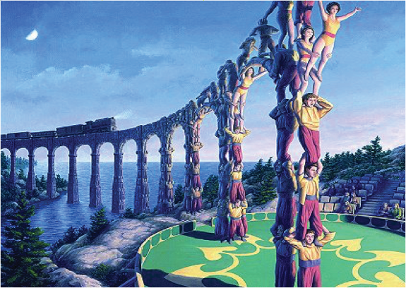

# UBUNTU
  
**"We can no longer wait for the systems to save us.
We are the ones we’ve been waiting for, and the time is now."**  
~ Starr MacKinnon

When I was talking about stepping out, then I don't mean that you should live like a yogi in asckese. We can do better. We are able to live in abundance if we have open ourselves to follow our heart.

Ubuntu is a global movement to liberate humanity from the financial money-slavery system and the societal practice of scarcity to transform our living experience to reflect the reality of our planet: Abundance & Prosperity for all - through Cooperation and Collaboration.  

Ubuntu als means, **I am, because we are**. We are able to create something big and beautiful together. I already mentinoned the possibility to create and to live in a community. In *Camp Eden*, another book, I wrote, I am talking about a community where we do not use money and where we do not trade with each other anymore.  
Everybody is doing something he or she is talented to. Something you do with dedication. Something you love and understand (I borrowed this sentence from Lynard Skynard).  

In Camp Eden we do not live in competition like in capitalism or communism. We live in contributionism. We work as ONE, hand in hand. No hierarchy. No fights. No wars.

If someone makes an invention, then you do not register it to the patent office, you make it public as open source instead. This way everybody is able to produce it in the town he lives and can develop it even further. Then the original inventor get this improvent in return.  

In such a community you do need to make money at all. We need no credits, we need no banks, we can build our own house on our own, without money. The neighbors like to help you, because they like to help in general.  

Decisions and laws are not made for the ones who have the most money. Decisions are made for the human beings and animals living there. In case of animals, we love them, so we don't produce them to create food.  

**"If its not good for everybody, then its not good at all."**  
~ Michael Tellinger

## Politics
Do we need politics at all?  
Maybe yes.
But what about talking circles, where everybody can help to make decision, where the elders can give their experience and are honored. We need consensus. Everybody should agree.  

We don't need laws at all.  
For me personal there is ONE law, that I have learned doing a driving license.  
**Do not harm anyone.**  
We do not need more laws.  
Everybody can remember this one rule.  
Much easier than today.  

## Industry
Yes, I want to right books in the future, so I need a computer. I want to be able to drive to the beach for surfing, I like to travel and I would like to stay in contact with the rest of the family all over the world.  
What about you?  
So we still need a kind of industry. But we are able to do better than now.  

Today we are producing things not because we need them, like food.  
We produce them to make money, to survive. That's why we have media and advertisments and everybody wants to sell you this crap that you don't need. There are companies who are producing cars. They have got parking lots full of thousands of cars, nobody wants to buy, because the people don't have the money to buy it.  

In the near future we only have to build cars which are really used by someone. Only a few. Old cars will be repaired. New cars will not fall appart after the guaranty is over. The community can share a car.

But therefore we need to create our own factories. Just imagine a factory where all people working, because they like to. They are not doing this to get money. They are doing this because they are able to and they want to do it. With this philosophy we are also able to produce these cars ever cheaper. The people love to buy and to use these cars, because they know, that these cars will not rust. These cars are solar powered. These cars are maybe powered by magnet motors, where you do not have to buy gas anymore.  

We are able to copy the product from these global players and produce them **cheaper** and more stable. These products are **sustainable**. Nobody will throw them away to create garbage. These products are **recyclable**.  

All the people in these factories are happy. There is no CEO who collects the money. No decisions are made only because of greed.

**Greed has poisoned mankind**  
~ Charly Chaplin